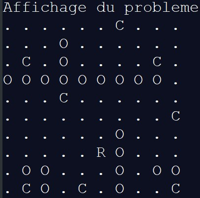
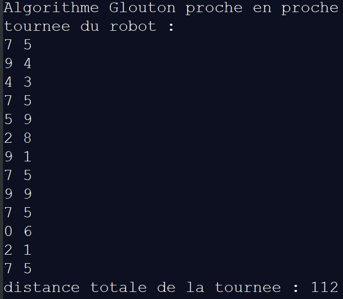

VRPwConstraintsonCheckerboard
=============================

Pedagogie
--------

Apprentissage du langage C++ au travers d'un probleme VRP.
Premier projet en C++

Probleme
--------
Problème de tournée de véhicule avec capacité

- Environnement : Damier avec des cases
- Livreur : Le livreur a une capacite de transport et sa base est sur une des cases
- Véhicule : 1 véhicule avec capacité
- Obstacles: Des obstacles sur des cases
- Clients : Les clients sur des cases, ils ont une demande. Le livreur est obligé de prendre toute la demande s'il prend le client

Objectif
--------
Proposer un parcours de tournées au livreur pour limiter la distance parcourue

Methodologie
------------

Utilisation de l'algorithme de Dijkstra pour déterminer les distances base du livreur-client et client-client.
Algorithme glouton proche en proche pour la sélection des clients, de fait solution non optimale

Exemple
-----------
Après avoir indiqué les paramètres :
- taille de plateau
- capacité du véhicule
- position des clients, de la base du livreur et des obstacles
- demande des clients

Cette visualisation du problème est obtenu (n'est pas visualisé la capacité du véhicule ainsi que les demandes clients) :

La solution donne les tournées du véhicule en indiquant la position où le livreur doit être successivement et la distance totale parcourue e.g.:

le coin supérieur gauche correspond à la position (0,0) et inférieur droit (9,9), où (ligne, colonne) est le système de coordonnées.

Amelioration restante
---------------------

Le programme ne marche pas s'il n'y a pas d'obstacle

